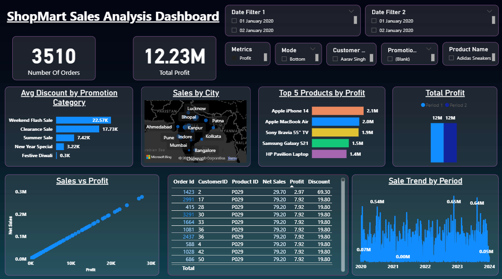

# 🛍️ ShopMart Retail Sales Analysis Dashboard – Power BI

## 📊 Project Overview

This project is a complete **end-to-end Power BI dashboard** designed to analyze and visualize the sales performance of a fictional retail company, **ShopMart**.  

The main goal was to transform raw transactional data into **meaningful insights** that can support strategic business decisions around **product performance, revenue trends, profitability, and customer behavior**.

It follows a complete analytics workflow — from **data cleaning and modeling** to **dynamic DAX calculations** and **interactive visualization design** — simulating a **real-world business scenario** rather than just a basic practice project.

---

## 🚀 Highlights

- 🧠 Built a fully interactive **Sales & Profit Analysis Dashboard** in Power BI.  
- 🔄 Designed intuitive **slicers and filters** for dynamic metric selection and **time period comparisons**.  
- 📊 Consolidated multiple separate visuals into **single, adaptive visuals** for a cleaner, more concise view.  
- 📈 Developed advanced **DAX measures** for KPIs like **Net Sales, Net Profit, Quantity Sold, ASP, and Margin %**.  
- 🔍 Implemented **drill-through capabilities** and order-level detail pages for deeper analysis.  
- 📢 Focused on **data storytelling** and delivering a dashboard that provides **quick, actionable insights**.

---

## 🛠️ Tools & Technologies

- **Power BI Desktop** – Data modeling, cleaning, and dashboard creation  
- **Power Query** – ETL and data preparation  
- **DAX** – Custom calculations and dynamic measures  
- **Excel / CSV** – Source data  
- **GitHub** – Version control and documentation

---

## 📁 How to Use

1. Clone this repository:
   ```bash
   git clone https://github.com/yourusername/shopmart-sales-analysis.git

   ## 📊 How to Use This Project

2. **Open the .pbix file** in Power BI Desktop.
3. **Explore the interactive dashboard**, slicers, and drill-through features to analyze the data.


## 📈 Business Value

This dashboard empowers business stakeholders to:

- ✅ Identify **top-performing and underperforming products**
- 📈 Track **sales, profit, and quantity trends** across time periods
- 🔄 Compare performance **year-over-year** or between **custom date ranges**
- 💸 Understand **pricing strategies and discount impacts**
- 📊 Make **data-driven decisions** to optimize product and revenue strategies

  

---
## 📷 Dashboard Preview




---


